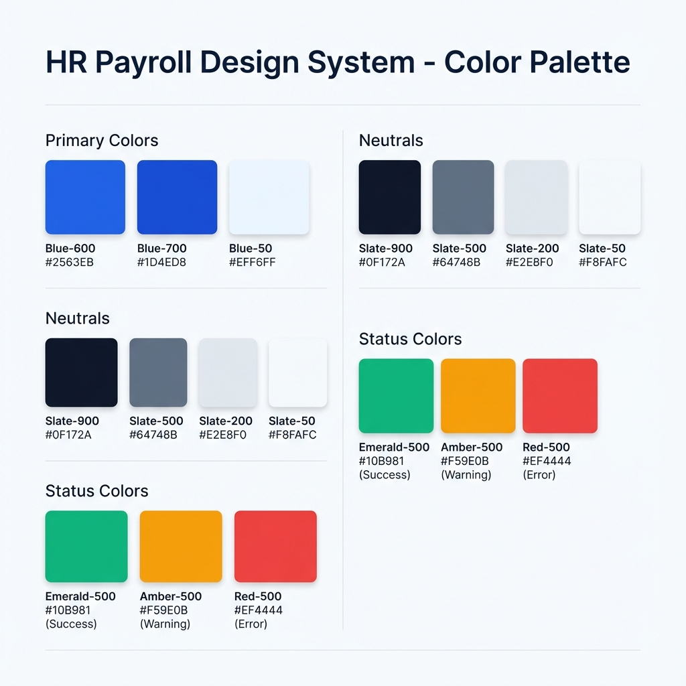

# HR Payroll System - Color Palette Strategy

## Design Philosophy

For an HR & Payroll system, the color palette must convey **Trust, Professionalism, and Clarity**.

- **Trust**: Deep blues are the standard for financial and enterprise software.
- **Clarity**: High contrast for data readability (tables, numbers).
- **Modernity**: Avoiding harsh "pure" colors in favor of slightly desaturated or "soft" tones (e.g., Slate instead of Gray).

## Color Palette

### 1. Primary Colors (Brand & Actions)

Used for primary buttons, active states, links, and key brand elements.

- **Primary Blue**: `#2563EB` (Tailwind Blue-600)
  - _Usage_: Main "Login" button, "Save" actions, Active menu items, Links.
- **Primary Hover**: `#1D4ED8` (Tailwind Blue-700)
  - _Usage_: Hover states for primary buttons.
- **Primary Light**: `#EFF6FF` (Tailwind Blue-50)
  - _Usage_: Background for active menu items, light accents.

### 2. Neutral Colors (Structure & Text)

Used for layout, borders, and typography. We use "Slate" (Cool Gray) for a modern, premium feel.

- **Surface White**: `#FFFFFF`
  - _Usage_: Card backgrounds, Input fields, Main content area.
- **Background**: `#F8FAFC` (Slate-50)
  - _Usage_: App background (behind cards), Dashboard background.
- **Main Text**: `#0F172A` (Slate-900)
  - _Usage_: Headings, Primary data values, Input text.
- **Secondary Text**: `#64748B` (Slate-500)
  - _Usage_: Labels, Descriptions, Metadata, Placeholder text.
- **Borders**: `#E2E8F0` (Slate-200)
  - _Usage_: Card borders, Dividers, Input borders.

### 3. Semantic Colors (Status & Feedback)

Critical for payroll status (Paid, Pending, Rejected).

- **Success (Green)**: `#10B981` (Emerald-500)
  - _Usage_: "Paid", "Approved", Positive trends.
- **Warning (Amber)**: `#F59E0B` (Amber-500)
  - _Usage_: "Pending", "Review Needed", Warnings.
- **Error (Red)**: `#EF4444` (Red-500)
  - _Usage_: "Rejected", "Overdue", Delete actions, Error messages.
- **Info (Sky)**: `#0EA5E9` (Sky-500)
  - _Usage_: Informational alerts, "Draft" status.

### 4. Data Visualization (Charts & Graphs)

Distinct colors for distinguishing data series in payroll reports.

- **Series 1**: `#2563EB` (Primary Blue)
- **Series 2**: `#10B981` (Emerald)
- **Series 3**: `#8B5CF6` (Violet)
- **Series 4**: `#F97316` (Orange)

## Usage Examples

| Element                 | Color                                    | Hex Code              |
| :---------------------- | :--------------------------------------- | :-------------------- |
| **Login Button**        | Primary Blue                             | `#2563EB`             |
| **Sidebar Active Item** | Primary Light (Bg) + Primary Blue (Text) | `#EFF6FF` + `#2563EB` |
| **Page Background**     | Slate-50                                 | `#F8FAFC`             |
| **Card Header Text**    | Slate-900                                | `#0F172A`             |
| **"Paid" Badge**        | Emerald-100 (Bg) + Emerald-700 (Text)    | `#D1FAE5` + `#047857` |
