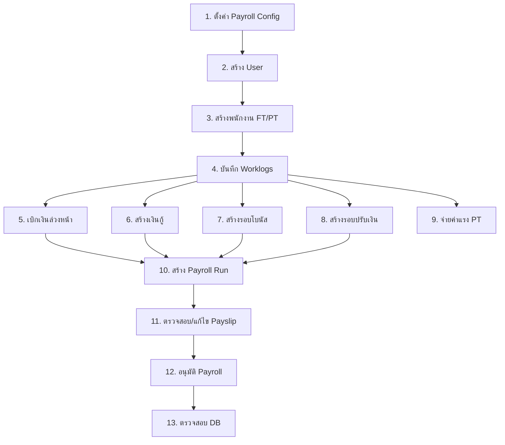

# HR Payroll System - Testing Flow Document

เอกสารนี้ออกแบบ flow การทดสอบระบบ HR Payroll ตั้งแต่การตั้งค่าระบบ สร้าง user สร้างพนักงาน บันทึกเวลางาน ไปจนถึงการทำเงินเดือน โดยระบุข้อมูลที่ต้องบันทึกผ่าน UI และ ตาราง Database ที่ต้องตรวจสอบ

---

> [!IMPORTANT] > **การแปลงค่าเปอร์เซ็นต์:** ค่า % ทุกฟิลด์ใน UI จะกรอกเป็นตัวเลขเต็ม (เช่น `5` สำหรับ 5%) แต่ใน Database จะเก็บเป็นทศนิยม (เช่น `0.05`)
>
> - UI: `5` → DB: `0.05`
> - UI: `3` → DB: `0.03`
> - UI: `50` → DB: `0.50`

---

## สารบัญ

1. [Phase 1: ตั้งค่าเริ่มต้นระบบ](#phase-1-ตั้งค่าเริ่มต้นระบบ)
2. [Phase 2: การจัดการผู้ใช้งาน](#phase-2-การจัดการผู้ใช้งาน)
3. [Phase 3: การจัดการพนักงาน](#phase-3-การจัดการพนักงาน)
4. [Phase 4: บันทึกเวลางาน (Worklogs)](#phase-4-บันทึกเวลางาน-worklogs)
5. [Phase 5: เบิกเงินล่วงหน้า (Salary Advance)](#phase-5-เบิกเงินล่วงหน้า-salary-advance)
6. [Phase 6: เงินกู้และหนี้สิน (Debt/Loan)](#phase-6-เงินกู้และหนี้สิน-debtloan)
7. [Phase 7: โบนัส (Bonus)](#phase-7-โบนัส-bonus)
8. [Phase 8: ปรับเงินเดือน (Salary Raise)](#phase-8-ปรับเงินเดือน-salary-raise)
9. [Phase 9: จ่ายค่าแรงพาร์ทไทม์นอกรอบ (PT Payout)](#phase-9-จ่ายค่าแรงพาร์ทไทม์นอกรอบ-pt-payout)
10. [Phase 10: ทำเงินเดือน (Payroll Run)](#phase-10-ทำเงินเดือน-payroll-run)
11. [Phase 11: ทดสอบ Filter และการค้นหา](#phase-11-ทดสอบ-filter-และการค้นหา)

---

## Phase 1: ตั้งค่าเริ่มต้นระบบ

### 1.1 Payroll Configuration (ตั้งค่าอัตราคำนวณ)

**หน้าจอ:** `/settings/payroll-config` (Admin Only)

#### ข้อมูลที่ต้องกรอก:

| ฟิลด์                                           | ตัวอย่างค่า        | คำอธิบาย                           |
| ----------------------------------------------- | ------------------ | ---------------------------------- |
| วันที่เริ่มมีผล (startDate)                     | `2025-01-01`       | วันที่ Config เริ่มใช้งาน          |
| ค่าแรงรายชั่วโมง (hourlyRate)                   | `400.00`           | สำหรับพนักงาน Part-time            |
| ค่า OT ต่อชั่วโมง (otHourlyRate)                | `600.00`           | โอทีของพนักงานประจำ                |
| เบี้ยขยันไม่สาย (attendanceBonusNoLate)         | `500.00`           |                                    |
| ฟิลด์                                           | ตัวอย่างค่า        | คำอธิบาย                           |
| ----------------------------------------------- | ------------------ | ---------------------------------- |
| วันที่เริ่มมีผล (startDate)                     | `2025-01-01`       | วันที่ Config เริ่มใช้งาน          |
| ค่าแรงรายชั่วโมง (hourlyRate)                   | `400.00`           | สำหรับพนักงาน Part-time            |
| ค่า OT ต่อชั่วโมง (otHourlyRate)                | `600.00`           | โอทีของพนักงานประจำ                |
| เบี้ยขยันไม่สาย (attendanceBonusNoLate)         | `500.00`           |                                    |
| เบี้ยขยันไม่ลา (attendanceBonusNoLeave)         | `1000.00`          |                                    |
| ค่าเช่าบ้าน (housingAllowance)                  | `1000.00`          |                                    |
| ค่าน้ำ/หน่วย (waterRatePerUnit)                 | `10.00`            |                                    |
| ค่าไฟ/หน่วย (electricityRatePerUnit)            | `7.00`             |                                    |
| ค่าเน็ต/เดือน (internetFeeMonthly)              | `100.00`           |                                    |
| ประกันสังคมลูกจ้าง (socialSecurityRateEmployee) | `5`                | UI: 5% → DB: 0.05                  |
| ประกันสังคมนายจ้าง (socialSecurityRateEmployer) | `5`                | UI: 5% → DB: 0.05                  |
| เพดาน SSO (socialSecurityWageCap)               | `15000.00`         |                                    |
| เปิดหักค่าใช้จ่าย (taxApplyStandardExpense)     | `true`             |                                    |
| อัตราค่าใช้จ่ายเหมา (taxStandardExpenseRate)    | `50`               | UI: 50% → DB: 0.50                 |
| เพดานค่าใช้จ่าย (taxStandardExpenseCap)         | `10000.00`         |                                    |
| ค่าลดหย่อนส่วนตัว (taxPersonalAllowanceAmount)  | `60000.00`         | รายปี                              |
| อัตราหัก ณ ที่จ่าย (withholdingTaxRateService)  | `3`                | UI: 3% → DB: 0.03 (ม.40(2))        |
| หมายเหตุ (note)                                 | `"Initial Config"` |                                    |

#### ตรวจสอบ Database:

```sql
-- ตาราง payroll_config
SELECT
  id, version_no, effective_daterange, status,
  hourly_rate, ot_hourly_rate,
  social_security_rate_employee, social_security_rate_employer,
  tax_progressive_brackets
FROM payroll_config
WHERE status = 'active';
```

**ผลลัพธ์ที่คาดหวัง:**

- Row ใหม่ถูกสร้างด้วย `status = 'active'`
- `effective_daterange` ครอบคลุมวันที่เริ่มมีผล
- `version_no` เพิ่มขึ้นจากเวอร์ชันก่อนหน้า

---

## Phase 2: การจัดการผู้ใช้งาน

### 2.1 Login ด้วย Admin Account

**หน้าจอ:** `/login`

#### ข้อมูลที่ต้องกรอก:

| ฟิลด์    | ตัวอย่างค่า        |
| -------- | ------------------ |
| Username | `admin`            |
| Password | `<admin password>` |

#### ตรวจสอบ Database:

```sql
-- ตาราง user_access_logs
SELECT id, user_id, login_at, status, ip_address
FROM user_access_logs
ORDER BY login_at DESC
LIMIT 1;
```

**ผลลัพธ์ที่คาดหวัง:**

- Row ใหม่ถูกสร้างด้วย `status = 'success'`

---

### 2.2 สร้าง User (HR)

**หน้าจอ:** `/admin/users` → กดปุ่ม "สร้างผู้ใช้ใหม่"

#### ข้อมูลที่ต้องกรอก:

| ฟิลด์    | ตัวอย่างค่า | คำอธิบาย                    |
| -------- | ----------- | --------------------------- |
| username | `hr_staff1` | ห้ามซ้ำ                     |
| password | `Hr@123456` | ต้องผ่านเงื่อนไขความปลอดภัย |
| role     | `hr`        | เลือก hr หรือ admin         |

#### ตรวจสอบ Database:

```sql
-- ตาราง users
SELECT id, username, user_role, created_at, deleted_at
FROM users
WHERE username = 'hr_staff1';
```

**ผลลัพธ์ที่คาดหวัง:**

- Row ใหม่ถูกสร้าง, `deleted_at = NULL`
- `user_role = 'hr'`
- `password_hash` ไม่เป็น plaintext

---

## Phase 3: การจัดการพนักงาน

### 3.1 สร้างพนักงานประจำ (Full-Time)

**หน้าจอ:** `/employees` → กดปุ่ม "เพิ่มพนักงาน"

#### ข้อมูลที่ต้องกรอก:

| ฟิลด์                                        | ตัวอย่างค่า               | คำอธิบาย          |
| -------------------------------------------- | ------------------------- | ----------------- |
| รหัสพนักงาน (employeeNumber)                 | `FT-001`                  | ห้ามซ้ำ           |
| คำนำหน้า (titleId)                           | เลือก "นาย"               |                   |
| ชื่อ (firstName)                             | `สมชาย`                   |                   |
| นามสกุล (lastName)                           | `ศรีสุข`                  |                   |
| ประเภทเอกสาร (idDocumentTypeId)              | เลือก "บัตรประชาชน"       |                   |
| เลขที่บัตร (idDocumentNumber)                | `1234567890123`           |                   |
| เบอร์โทร (phone)                             | `0812345678`              |                   |
| อีเมล (email)                                | `somchai@example.com`     |                   |
| ประเภทพนักงาน (employeeTypeId)               | เลือก "ประจำ" (full_time) |                   |
| เงินเดือน (basePayAmount)                    | `30000.00`                |                   |
| วันเริ่มงาน (employmentStartDate)            | `2024-06-01`              |                   |
| ธนาคาร (bankName)                            | `KBank`                   |                   |
| เลขบัญชี (bankAccountNo)                     | `123-4-56789-0`           |                   |
| ส่งประกันสังคม (ssoContribute)               | `true`                    |                   |
| ฐาน SSO (ssoDeclaredWage)                    | `15000.00`                |                   |
| ส่งกองทุน (providentFundContribute)          | `true`                    |                   |
| อัตราลูกจ้าง PVD (providentFundRateEmployee) | `3`                       | UI: 3% → DB: 0.03 |
| อัตรานายจ้าง PVD (providentFundRateEmployer) | `3`                       | UI: 3% → DB: 0.03 |
| หักภาษี (withholdTax)                        | `true`                    |                   |
| สิทธิ์ค่าเช่าบ้าน (allowHousing)             | `true`                    |                   |
| สิทธิ์ค่าน้ำ (allowWater)                    | `false`                   |                   |
| สิทธิ์ค่าไฟ (allowElectric)                  | `false`                   |                   |
| สิทธิ์ค่าเน็ต (allowInternet)                | `true`                    |                   |
| สิทธิ์ค่าแพทย์ (allowDoctorFee)              | `true`                    |                   |

#### ตรวจสอบ Database:

```sql
-- ตาราง employees
SELECT
  id, employee_number, first_name, last_name,
  employee_type_id, base_pay_amount,
  sso_contribute, sso_declared_wage,
  provident_fund_contribute, provident_fund_rate_employee,
  withhold_tax, allow_housing, allow_doctor_fee
FROM employees
WHERE employee_number = 'FT-001';
```

**ผลลัพธ์ที่คาดหวัง:**

- Row ใหม่ถูกสร้าง
- `employee_type_id` ตรงกับ "ประจำ"
- ค่า boolean flags ตรงตามที่กรอก

---

### 3.2 สร้างพนักงานพาร์ทไทม์ (Part-Time)

**หน้าจอ:** `/employees` → กดปุ่ม "เพิ่มพนักงาน"

#### ข้อมูลที่ต้องกรอก:

| ฟิลด์                               | ตัวอย่างค่า                   | คำอธิบาย           |
| ----------------------------------- | ----------------------------- | ------------------ |
| รหัสพนักงาน (employeeNumber)        | `PT-001`                      |                    |
| คำนำหน้า                            | เลือก "นางสาว"                |                    |
| ชื่อ (firstName)                    | `สมหญิง`                      |                    |
| นามสกุล (lastName)                  | `ใจดี`                        |                    |
| ประเภทเอกสาร                        | เลือก "บัตรประชาชน"           |                    |
| เลขที่บัตร                          | `9876543210987`               |                    |
| ประเภทพนักงาน (employeeTypeId)      | เลือก "พาร์ทไทม์" (part_time) |                    |
| ค่าแรง/ชม (basePayAmount)           | `0.00`                        | ใช้จาก config      |
| วันเริ่มงาน                         | `2025-01-15`                  |                    |
| ส่งประกันสังคม (ssoContribute)      | `false`                       | ส่วนใหญ่ PT ไม่ส่ง |
| ส่งกองทุน (providentFundContribute) | `false`                       |                    |
| หักภาษี (withholdTax)               | `false`                       |                    |

#### ตรวจสอบ Database:

```sql
SELECT id, employee_number, first_name, employee_type_id,
       sso_contribute, withhold_tax
FROM employees
WHERE employee_number = 'PT-001';
```

---

## Phase 4: บันทึกเวลางาน (Worklogs)

### 4.1 บันทึกเวลา FT Worklog (สาย/ลา/OT)

**หน้าจอ:** `/worklogs/ft`

#### ข้อมูลที่ต้องกรอก:

| ฟิลด์                | ตัวอย่างค่า          | คำอธิบาย                                       |
| -------------------- | -------------------- | ---------------------------------------------- |
| พนักงาน (employeeId) | เลือก "FT-001 สมชาย" |                                                |
| วันที่ (workDate)    | `2025-11-15`         |                                                |
| ประเภท (entryType)   | `late`               | late, leave_day, leave_hours, leave_double, ot |
| จำนวน (quantity)     | `15`                 | นาที (สาย), ชม (OT), วัน (ลา)                  |

**ทดสอบหลายรายการ:**

1. **สาย (late):** `workDate: 2025-11-15`, `entryType: late`, `quantity: 15` (นาที)
2. **ลาวัน (leave_day):** `workDate: 2025-11-18`, `entryType: leave_day`, `quantity: 1` (วัน)
3. **ลาดับเบิ้ล (leave_double):** `workDate: 2025-11-19`, `entryType: leave_double`, `quantity: 1` (วัน)
4. **ลาชั่วโมง (leave_hours):** `workDate: 2025-11-20`, `entryType: leave_hours`, `quantity: 2` (ชม)
5. **OT:** `workDate: 2025-11-21`, `entryType: ot`, `quantity: 3` (ชม)

#### ตรวจสอบ Database:

```sql
-- ตาราง worklog_ft
SELECT
  id, employee_id, work_date, entry_type, quantity, status
FROM worklog_ft
WHERE employee_id = '<employee_id_of_FT-001>'
ORDER BY work_date;
```

**ผลลัพธ์ที่คาดหวัง:**

- แต่ละรายการมี `status = 'pending'`
- `quantity` ตรงกับที่กรอก

---

### 4.2 บันทึกเวลา PT Worklog (เข้า-ออก)

**หน้าจอ:** `/worklogs/pt`

#### ข้อมูลที่ต้องกรอก:

| ฟิลด์                | ตัวอย่างค่า           | คำอธิบาย |
| -------------------- | --------------------- | -------- |
| พนักงาน (employeeId) | เลือก "PT-001 สมหญิง" |          |
| วันที่ (workDate)    | `2025-11-15`          |          |
| เข้าเช้า (morningIn) | `08:00`               |          |
| ออกเช้า (morningOut) | `12:00`               |          |
| เข้าบ่าย (eveningIn) | `13:00`               |          |
| ออกบ่าย (eveningOut) | `17:00`               |          |

**ทดสอบหลายวัน:**

- วันที่ 15-19 พ.ย. 2025 (5 วัน x 8 ชม = 40 ชม)

#### ตรวจสอบ Database:

```sql
-- ตาราง worklog_pt
SELECT
  id, employee_id, work_date,
  morning_in, morning_out, morning_minutes,
  evening_in, evening_out, evening_minutes,
  total_minutes, total_hours, status
FROM worklog_pt
WHERE employee_id = '<employee_id_of_PT-001>';
```

**ผลลัพธ์ที่คาดหวัง:**

- `total_minutes = 480` (8 ชม)
- `total_hours = 8.00`
- `status = 'pending'`

---

## Phase 5: เบิกเงินล่วงหน้า (Salary Advance)

**หน้าจอ:** `/salary-advance`

### 5.1 สร้างรายการเบิกเงินล่วงหน้า

#### ข้อมูลที่ต้องกรอก:

| ฟิลด์                        | ตัวอย่างค่า          | คำอธิบาย |
| ---------------------------- | -------------------- | -------- |
| พนักงาน (employeeId)         | เลือก "FT-001 สมชาย" |          |
| ยอดเงิน (amount)             | `5000.00`            |          |
| วันที่รับ (advanceDate)      | `2025-11-20`         |          |
| งวดที่หัก (payrollMonthDate) | `2025-12-01`         | งวด ธ.ค. |

#### ตรวจสอบ Database:

```sql
-- ตาราง salary_advance
SELECT
  id, employee_id, amount, advance_date,
  payroll_month_date, status
FROM salary_advance
WHERE employee_id = '<employee_id>'
  AND payroll_month_date = '2025-12-01';
```

**ผลลัพธ์ที่คาดหวัง:**

- `status = 'pending'`
- `payroll_month_date = '2025-12-01'`

---

## Phase 6: เงินกู้และหนี้สิน (Debt/Loan)

**หน้าจอ:** `/debt`

### 6.1 สร้างเงินกู้พร้อมงวดผ่อน

#### ข้อมูลที่ต้องกรอก:

| ฟิลด์                | ตัวอย่างค่า                                    | คำอธิบาย        |
| -------------------- | ---------------------------------------------- | --------------- |
| พนักงาน (employeeId) | เลือก "FT-001 สมชาย"                           |                 |
| ประเภท (txnType)     | `loan`                                         | loan หรือ other |
| วันที่ (txnDate)     | `2025-11-21`                                   |                 |
| ยอดเงินกู้ (amount)  | `12000.00`                                     |                 |
| เหตุผล (reason)      | `กู้ซ่อมบ้าน`                                  |                 |
| **งวดผ่อนชำระ:**     |                                                |                 |
| งวด 1                | amount: `4000`, payrollMonthDate: `2025-12-01` |                 |
| งวด 2                | amount: `4000`, payrollMonthDate: `2026-01-01` |                 |
| งวด 3                | amount: `4000`, payrollMonthDate: `2026-02-01` |                 |

#### ตรวจสอบ Database:

```sql
-- ตาราง debt_txn (Parent)
SELECT id, employee_id, txn_type, amount, status, reason
FROM debt_txn
WHERE txn_type = 'loan' AND employee_id = '<employee_id>';

-- ตาราง debt_txn (Installments)
SELECT id, parent_id, txn_type, amount, payroll_month_date, status
FROM debt_txn
WHERE parent_id = '<loan_id>'
ORDER BY payroll_month_date;
```

**ผลลัพธ์ที่คาดหวัง:**

- Parent: `txn_type = 'loan'`, `status = 'pending'`
- 3 installments: `txn_type = 'installment'`, `status = 'pending'`
- ยอดรวม installments = 12000

### 6.2 อนุมัติเงินกู้ (Admin Only)

**หน้าจอ:** `/debt/<loan_id>` → กดปุ่ม "อนุมัติ"

#### ตรวจสอบ Database:

```sql
SELECT id, status FROM debt_txn WHERE id = '<loan_id>';
```

**ผลลัพธ์ที่คาดหวัง:**

- Parent loan: `status = 'approved'`
- Installments ยังคงเป็น `status = 'pending'` (จะเปลี่ยนเมื่อหักเงินเดือน)

---

## Phase 7: โบนัส (Bonus)

**หน้าจอ:** `/bonuses`

### 7.1 สร้างรอบโบนัส

#### ข้อมูลที่ต้องกรอก:

| ฟิลด์                           | ตัวอย่างค่า  | คำอธิบาย |
| ------------------------------- | ------------ | -------- |
| งวดจ่าย (payrollMonthDate)      | `2025-12-01` |          |
| เริ่มนับสถิติ (periodStartDate) | `2025-01-01` |          |
| สิ้นสุดนับสถิติ (periodEndDate) | `2025-11-30` |          |

#### ตรวจสอบ Database:

```sql
-- ตาราง bonus_cycle
SELECT id, payroll_month_date, period_start_date, period_end_date, status
FROM bonus_cycle
WHERE payroll_month_date = '2025-12-01';

-- ตาราง bonus_item (Auto-generated)
SELECT
  bi.id, bi.employee_id, e.employee_number,
  bi.tenure_days, bi.current_salary,
  bi.late_minutes, bi.leave_days, bi.ot_hours,
  bi.bonus_months, bi.bonus_amount
FROM bonus_item bi
JOIN employees e ON bi.employee_id = e.id
WHERE bi.cycle_id = '<cycle_id>';
```

**ผลลัพธ์ที่คาดหวัง:**

- `bonus_item` ถูกสร้างให้ FT employees ทุกคนอัตโนมัติ (Trigger)
- `late_minutes`, `leave_days` ถูกคำนวณจาก worklog_ft

### 7.2 กรอกยอดโบนัสรายคน

**หน้าจอ:** `/bonuses/<cycle_id>` → แก้ไขแต่ละรายการ

#### ข้อมูลที่ต้องกรอก:

| ฟิลด์                   | ตัวอย่างค่า | คำอธิบาย             |
| ----------------------- | ----------- | -------------------- |
| จำนวนเท่า (bonusMonths) | `1.5`       | 1.5 เท่าของเงินเดือน |
| ยอดโบนัส (bonusAmount)  | `45000.00`  | 30000 x 1.5          |

### 7.3 อนุมัติรอบโบนัส (Admin Only)

#### ตรวจสอบ Database:

```sql
SELECT status FROM bonus_cycle WHERE id = '<cycle_id>';
```

**ผลลัพธ์ที่คาดหวัง:** `status = 'approved'`

---

## Phase 8: ปรับเงินเดือน (Salary Raise)

**หน้าจอ:** `/salary-raise`

### 8.1 สร้างรอบปรับเงินเดือน

#### ข้อมูลที่ต้องกรอก:

| ฟิลด์                      | ตัวอย่างค่า  | คำอธิบาย |
| -------------------------- | ------------ | -------- |
| เริ่มนับ (periodStartDate) | `2025-01-01` |          |
| สิ้นสุดนับ (periodEndDate) | `2025-12-31` |          |

#### ตรวจสอบ Database:

```sql
-- ตาราง salary_raise_cycle
SELECT id, period_start_date, period_end_date, status
FROM salary_raise_cycle
WHERE deleted_at IS NULL
ORDER BY created_at DESC
LIMIT 1;

-- ตาราง salary_raise_item (Auto-generated)
SELECT
  sri.id, e.employee_number,
  sri.tenure_days, sri.current_salary, sri.current_sso_wage,
  sri.raise_percent, sri.raise_amount, sri.new_salary,
  sri.late_minutes, sri.leave_days
FROM salary_raise_item sri
JOIN employees e ON sri.employee_id = e.id
WHERE sri.cycle_id = '<cycle_id>';
```

### 8.2 กรอกเปอร์เซ็นต์ปรับ

#### ข้อมูลที่ต้องกรอก:

| ฟิลด์                     | ตัวอย่างค่า | คำอธิบาย                                                           |
| ------------------------- | ----------- | ------------------------------------------------------------------ |
| % ปรับ (raisePercent)     | `5`         | UI: 5% → DB: 5.00 (หมายเหตุ: raisePercent เก็บเป็น % ไม่ใช่ทศนิยม) |
| ยอดปรับ (raiseAmount)     | `1500.00`   | 30000 × 5%                                                         |
| เงินเดือนใหม่ (newSalary) | `31500.00`  |                                                                    |

### 8.3 อนุมัติรอบปรับเงินเดือน (Admin Only)

#### ตรวจสอบ Database:

```sql
-- ตรวจสอบว่า employees.base_pay_amount ถูกอัปเดต
SELECT employee_number, base_pay_amount
FROM employees
WHERE employee_number = 'FT-001';
```

**ผลลัพธ์ที่คาดหวัง:**

- `base_pay_amount = 31500.00` (Trigger อัปเดตให้อัตโนมัติ)

---

## Phase 9: จ่ายค่าแรงพาร์ทไทม์นอกรอบ (PT Payout)

**หน้าจอ:** `/payouts/pt`

> [!NOTE] > **PT Payout คืออะไร?**
>
> - เป็นการจ่ายค่าแรง PT **นอกรอบเงินเดือน** สำหรับกรณี:
>   - PT ที่ทำงานไม่เต็มเดือน และต้องการรับเงินก่อนรอบเงินเดือน
>   - PT ที่ต้องการเบิกบางส่วนล่วงหน้า
> - **สำคัญ:** Worklog ที่จ่ายผ่าน PT Payout ไปแล้ว **จะไม่ถูกนำมาคิดในรอบเงินเดือน (Payroll Run)**

### 9.1 สร้างใบเบิกจ่าย

#### ข้อมูลที่ต้องกรอก:

| ฟิลด์                     | ตัวอย่างค่า           | คำอธิบาย         |
| ------------------------- | --------------------- | ---------------- |
| พนักงาน (employeeId)      | เลือก "PT-001 สมหญิง" |                  |
| รายการลงเวลา (worklogIds) | เลือกทั้ง 5 วัน       | status = pending |

#### ตรวจสอบ Database:

```sql
-- ตาราง payout_pt
SELECT
  id, employee_id, status,
  total_minutes, total_hours,
  hourly_rate_used, amount_total
FROM payout_pt
WHERE employee_id = '<employee_id>';

-- ตาราง payout_pt_item
SELECT ppi.id, ppi.worklog_id, wp.work_date, wp.total_hours
FROM payout_pt_item ppi
JOIN worklog_pt wp ON ppi.worklog_id = wp.id
WHERE ppi.payout_id = '<payout_id>';

-- ตรวจสอบ worklog status
SELECT id, status FROM worklog_pt WHERE id IN (<worklog_ids>);
```

**ผลลัพธ์ที่คาดหวัง:**

- `payout_pt.status = 'to_pay'`
- `total_hours = 40.00` (5 วัน x 8 ชม)
- `amount_total = 16000.00` (40 ชม x 400 บาท)
- worklog status เปลี่ยนเป็น `'to_pay'`

### 9.2 บันทึกจ่ายเงินแล้ว (Admin Only)

**หน้าจอ:** `/payouts/pt/<id>` → กดปุ่ม "จ่ายเงินแล้ว"

#### ตรวจสอบ Database:

```sql
SELECT status, paid_at FROM payout_pt WHERE id = '<payout_id>';
SELECT status FROM worklog_pt WHERE id IN (<worklog_ids>);
```

**ผลลัพธ์ที่คาดหวัง:**

- `payout_pt.status = 'paid'`
- `paid_at` มีค่า
- worklog status เปลี่ยนเป็น `'paid'`

---

## Phase 10: ทำเงินเดือน (Payroll Run)

**หน้าจอ:** `/payroll`

### 10.1 สร้างงวดเงินเดือน

#### ข้อมูลที่ต้องกรอก:

| ฟิลด์                         | ตัวอย่างค่า  | คำอธิบาย                              |
| ----------------------------- | ------------ | ------------------------------------- |
| งวดเดือน (payrollMonthDate)   | `2025-12-01` | ต้องเป็นวันที่ 1                      |
| วันเริ่มนับ (periodStartDate) | `2025-11-01` |                                       |
| วันจ่ายเงิน (payDate)         | `2025-12-28` |                                       |
| อัตรา SSO ลูกจ้าง             | `5`          | UI: 5% → DB: 0.05 (Snapshot ณ งวดนี้) |
| อัตรา SSO นายจ้าง             | `5`          | UI: 5% → DB: 0.05                     |

#### ตรวจสอบ Database:

```sql
-- ตาราง payroll_run
SELECT
  id, payroll_month_date, period_start_date, pay_date,
  social_security_rate_employee, status
FROM payroll_run
WHERE payroll_month_date = '2025-12-01';

-- ตาราง payroll_run_item (Auto-generated by Trigger)
SELECT
  pri.id, e.employee_number, et.code as emp_type,
  pri.salary_amount, pri.ot_amount, pri.bonus_amount,
  pri.late_minutes_qty, pri.late_minutes_deduction,
  pri.leave_days_qty, pri.leave_days_deduction,
  pri.sso_month_amount, pri.tax_month_amount,
  pri.advance_amount, pri.loan_repayments,
  pri.income_total
FROM payroll_run_item pri
JOIN employees e ON pri.employee_id = e.id
JOIN employee_type et ON pri.employee_type_id = et.id
WHERE pri.run_id = '<run_id>';
```

**ผลลัพธ์ที่คาดหวัง:**

- `payroll_run.status = 'pending'`
- มี `payroll_run_item` สำหรับ FT และ PT employees
- สำหรับ FT-001:
  - `salary_amount = 30000` (หรือ 31500 ถ้าปรับเงินเดือนแล้ว)
  - `ot_amount = 1800` (3 ชม x 600 บาท)
  - `bonus_amount = 45000` (จาก Phase 7)
  - `late_minutes_qty = 15`
  - `advance_amount = 5000` (จาก Phase 5)
  - `loan_repayments` มียอดงวดแรก 4000

---

### 10.2 ตรวจสอบและแก้ไข Payslip

**หน้าจอ:** `/payroll/<run_id>` → คลิกที่แถวพนักงาน

#### ฟิลด์ที่สามารถแก้ไขได้:

| กลุ่ม      | ฟิลด์                  | ตัวอย่าง                  |
| ---------- | ---------------------- | ------------------------- |
| **รายได้** | salaryAmount           | แก้เงินเดือนเฉพาะเดือนนี้ |
|            | otAmount               | แก้ค่า OT                 |
|            | bonusAmount            | แก้โบนัส                  |
|            | housingAllowance       | ค่าเช่าบ้าน               |
|            | doctorFee              | ค่าแพทย์                  |
|            | othersIncome           | รายได้อื่นๆ (JSON)        |
| **รายหัก** | waterMeterPrev/Curr    | มิเตอร์น้ำ                |
|            | electricMeterPrev/Curr | มิเตอร์ไฟ                 |
|            | loanRepayments         | ยอดหักหนี้ (JSON)         |
|            | ssoMonthAmount         | ประกันสังคม               |
|            | taxMonthAmount         | ภาษี                      |
|            | pfMonthAmount          | กองทุน                    |

#### ตรวจสอบ Database:

```sql
SELECT * FROM payroll_run_item WHERE id = '<item_id>';
```

---

### 10.3 อนุมัติงวดเงินเดือน (Admin Only)

**หน้าจอ:** `/payroll/<run_id>` → กดปุ่ม "อนุมัติ"

#### ตรวจสอบ Database:

```sql
-- 1. ตาราง payroll_run
SELECT status, approved_at FROM payroll_run WHERE id = '<run_id>';

-- 2. ตาราง worklog_ft (status เปลี่ยน)
SELECT id, status FROM worklog_ft
WHERE employee_id = '<ft_employee_id>' AND work_date BETWEEN '2025-11-01' AND '2025-11-30';

-- 3. ตาราง salary_advance (status เปลี่ยน)
SELECT id, status FROM salary_advance
WHERE payroll_month_date = '2025-12-01';

-- 4. ตาราง debt_txn (installment status เปลี่ยน)
SELECT id, txn_type, status FROM debt_txn
WHERE payroll_month_date = '2025-12-01' AND txn_type = 'installment';

-- 5. ตาราง payroll_accumulation (ยอดสะสมถูกอัปเดต)
SELECT employee_id, accum_type, accum_year, amount
FROM payroll_accumulation
WHERE employee_id = '<ft_employee_id>';
```

**ผลลัพธ์ที่คาดหวัง:**

1. `payroll_run.status = 'approved'`
2. `worklog_ft.status = 'approved'`
3. `salary_advance.status = 'processed'`
4. `debt_txn (installment).status = 'approved'`
5. `payroll_accumulation` มียอดสะสม SSO, Tax, PF อัปเดต

---

## สรุป Flow การทดสอบ



---

## ตารางสรุป Database Tables

| Phase | หน้าจอ         | Tables ที่ต้องตรวจสอบ                                                                                 |
| ----- | -------------- | ----------------------------------------------------------------------------------------------------- |
| 1     | Payroll Config | `payroll_config`                                                                                      |
| 2     | Login/Users    | `users`, `user_access_logs`, `auth_refresh_tokens`                                                    |
| 3     | Employees      | `employees`, `person_title`, `employee_type`, `id_document_type`                                      |
| 4a    | FT Worklogs    | `worklog_ft`                                                                                          |
| 4b    | PT Worklogs    | `worklog_pt`                                                                                          |
| 5     | Salary Advance | `salary_advance`                                                                                      |
| 6     | Debt/Loan      | `debt_txn`                                                                                            |
| 7     | Bonus          | `bonus_cycle`, `bonus_item`                                                                           |
| 8     | Salary Raise   | `salary_raise_cycle`, `salary_raise_item`, `employees`                                                |
| 9     | PT Payout      | `payout_pt`, `payout_pt_item`, `worklog_pt`                                                           |
| 10    | Payroll        | `payroll_run`, `payroll_run_item`, `payroll_accumulation`, `salary_advance`, `debt_txn`, `worklog_ft` |
| 11    | Filters        | (ไม่มี DB check - ตรวจสอบผลลัพธ์ใน UI)                                                                |

---

## Phase 11: ทดสอบ Filter และการค้นหา

### 11.1 Employees List (`/employees`)

| Filter             | ค่าที่ทดสอบ                     | ผลลัพธ์ที่คาดหวัง                              |
| ------------------ | ------------------------------- | ---------------------------------------------- |
| **search**         | `FT-001`                        | แสดงเฉพาะ FT-001                               |
| **search**         | `สมชาย`                         | แสดงพนักงานชื่อ "สมชาย"                        |
| **search**         | `@example.com`                  | แสดงพนักงานที่มีอีเมลลงท้ายด้วย @example.com   |
| **status**         | `active`                        | แสดงเฉพาะพนักงานที่ยังทำงานอยู่                |
| **status**         | `terminated`                    | แสดงเฉพาะพนักงานที่ลาออกแล้ว                   |
| **status**         | `all`                           | แสดงทั้งหมด                                    |
| **employeeTypeId** | เลือก "ประจำ"                   | แสดงเฉพาะ Full-Time                            |
| **employeeTypeId** | เลือก "พาร์ทไทม์"               | แสดงเฉพาะ Part-Time                            |
| **รวม Filters**    | `search: สม` + `status: active` | แสดงพนักงานที่ชื่อขึ้นต้น "สม" และยังทำงานอยู่ |

---

### 11.2 Users List (`/admin/users`)

| Filter     | ค่าที่ทดสอบ | ผลลัพธ์ที่คาดหวัง         |
| ---------- | ----------- | ------------------------- |
| **role**   | `admin`     | แสดงเฉพาะ Admin           |
| **role**   | `hr`        | แสดงเฉพาะ HR              |
| **search** | `hr_`       | แสดง user ที่ขึ้นต้น hr\_ |

---

### 11.3 FT Worklogs (`/worklogs/ft`)

| Filter         | ค่าที่ทดสอบ       | ผลลัพธ์ที่คาดหวัง                               |
| -------------- | ----------------- | ----------------------------------------------- |
| **employeeId** | เลือก "FT-001"    | แสดงเฉพาะ worklog ของ FT-001                    |
| **entryType**  | `late`            | แสดงเฉพาะรายการสาย                              |
| **entryType**  | `leave_day`       | แสดงเฉพาะรายการลาวัน                            |
| **entryType**  | `ot`              | แสดงเฉพาะรายการ OT                              |
| **status**     | `pending`         | แสดงเฉพาะที่รอดำเนินการ                         |
| **status**     | `approved`        | แสดงเฉพาะที่อนุมัติแล้ว                         |
| **startDate**  | `2025-11-01`      | แสดงตั้งแต่วันที่ 1 พ.ย. เป็นต้นไป              |
| **endDate**    | `2025-11-30`      | แสดงถึงวันที่ 30 พ.ย.                           |
| **รวม**        | employee + status | แสดง worklog ของพนักงานที่เลือก + สถานะที่เลือก |

---

### 11.4 PT Worklogs (`/worklogs/pt`)

| Filter         | ค่าที่ทดสอบ    | ผลลัพธ์ที่คาดหวัง            |
| -------------- | -------------- | ---------------------------- |
| **employeeId** | เลือก "PT-001" | แสดงเฉพาะ worklog ของ PT-001 |
| **status**     | `pending`      | แสดงรายการที่ยังไม่ได้จ่าย   |
| **status**     | `to_pay`       | แสดงรายการที่รอจ่าย          |
| **status**     | `paid`         | แสดงรายการที่จ่ายแล้ว        |
| **startDate**  | `2025-11-01`   | กรองช่วงวันที่เริ่มต้น       |
| **endDate**    | `2025-11-30`   | กรองช่วงวันที่สิ้นสุด        |

---

### 11.5 Salary Advance (`/salary-advance`)

| Filter           | ค่าที่ทดสอบ  | ผลลัพธ์ที่คาดหวัง                 |
| ---------------- | ------------ | --------------------------------- |
| **employeeId**   | เลือกพนักงาน | แสดงเฉพาะรายการเบิกของพนักงานนั้น |
| **payrollMonth** | `2025-12-01` | แสดงเฉพาะงวด ธ.ค. 2025            |
| **status**       | `pending`    | แสดงรายการที่รอหัก                |
| **status**       | `processed`  | แสดงรายการที่หักแล้ว              |

---

### 11.6 Debt/Loan (`/debt`)

| Filter         | ค่าที่ทดสอบ  | ผลลัพธ์ที่คาดหวัง           |
| -------------- | ------------ | --------------------------- |
| **employeeId** | เลือกพนักงาน | แสดงเฉพาะหนี้ของพนักงานนั้น |
| **type**       | `loan`       | แสดงเฉพาะเงินกู้            |
| **type**       | `other`      | แสดงเฉพาะหนี้สินอื่นๆ       |
| **status**     | `pending`    | แสดงรายการที่รออนุมัติ      |
| **status**     | `approved`   | แสดงรายการที่อนุมัติแล้ว    |
| **startDate**  | `2025-01-01` | กรองตาม txnDate เริ่มต้น    |
| **endDate**    | `2025-12-31` | กรองตาม txnDate สิ้นสุด     |

---

### 11.7 Bonus Cycles (`/bonuses`)

| Filter     | ค่าที่ทดสอบ | ผลลัพธ์ที่คาดหวัง     |
| ---------- | ----------- | --------------------- |
| **status** | `pending`   | แสดงรอบที่รออนุมัติ   |
| **status** | `approved`  | แสดงรอบที่อนุมัติแล้ว |
| **status** | `rejected`  | แสดงรอบที่ไม่อนุมัติ  |
| **year**   | `2025`      | แสดงเฉพาะรอบปี 2025   |

---

### 11.8 Salary Raise Cycles (`/salary-raise`)

| Filter     | ค่าที่ทดสอบ | ผลลัพธ์ที่คาดหวัง     |
| ---------- | ----------- | --------------------- |
| **status** | `pending`   | แสดงรอบที่รออนุมัติ   |
| **status** | `approved`  | แสดงรอบที่อนุมัติแล้ว |
| **status** | `rejected`  | แสดงรอบที่ไม่อนุมัติ  |
| **year**   | `2025`      | แสดงเฉพาะรอบปี 2025   |

---

### 11.9 PT Payouts (`/payouts/pt`)

| Filter         | ค่าที่ทดสอบ    | ผลลัพธ์ที่คาดหวัง         |
| -------------- | -------------- | ------------------------- |
| **employeeId** | เลือก "PT-001" | แสดงเฉพาะใบจ่ายของ PT-001 |
| **status**     | `to_pay`       | แสดงใบที่รอจ่าย           |
| **status**     | `paid`         | แสดงใบที่จ่ายแล้ว         |

---

### 11.10 Payroll Runs (`/payroll`)

| Filter        | ค่าที่ทดสอบ  | ผลลัพธ์ที่คาดหวัง      |
| ------------- | ------------ | ---------------------- |
| **year**      | `2025`       | แสดงเฉพาะงวดปี 2025    |
| **monthDate** | `2025-12-01` | แสดงเฉพาะงวด ธ.ค. 2025 |
| **status**    | `pending`    | แสดงงวดที่รออนุมัติ    |
| **status**    | `approved`   | แสดงงวดที่อนุมัติแล้ว  |

---

### 11.11 Payroll Items (รายการในงวด) (`/payroll/{id}`)

| Filter               | ค่าที่ทดสอบ | ผลลัพธ์ที่คาดหวัง       |
| -------------------- | ----------- | ----------------------- |
| **search**           | `FT-001`    | แสดงเฉพาะพนักงาน FT-001 |
| **search**           | `สมชาย`     | แสดงเฉพาะชื่อ "สมชาย"   |
| **employeeTypeCode** | `full_time` | แสดงเฉพาะ Full-Time     |
| **employeeTypeCode** | `part_time` | แสดงเฉพาะ Part-Time     |

---

### 11.12 Payroll Config (`/settings/payroll-config`)

| Filter     | ค่าที่ทดสอบ | ผลลัพธ์ที่คาดหวัง          |
| ---------- | ----------- | -------------------------- |
| **status** | `active`    | แสดง config ที่ใช้งานอยู่  |
| **status** | `retired`   | แสดง config ที่หมดอายุแล้ว |

---

## สรุป Filters ทั้งหมด

| หน้าจอ         | Filters ที่มี                                     |
| -------------- | ------------------------------------------------- |
| Employees      | search, status, employeeTypeId                    |
| Users          | role, search                                      |
| FT Worklogs    | employeeId, entryType, status, startDate, endDate |
| PT Worklogs    | employeeId, status, startDate, endDate            |
| Salary Advance | employeeId, payrollMonth, status                  |
| Debt/Loan      | employeeId, type, status, startDate, endDate      |
| Bonus Cycles   | status, year                                      |
| Salary Raise   | status, year                                      |
| PT Payouts     | employeeId, status                                |
| Payroll Runs   | year, monthDate, status                           |
| Payroll Items  | search, employeeTypeCode                          |
| Payroll Config | status                                            |
