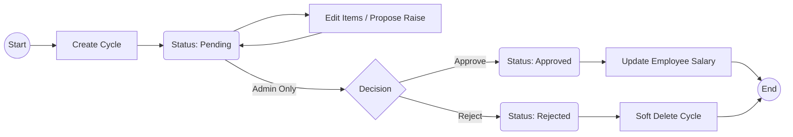

# Salary Raise Management Workflow

เอกสารนี้สรุปกระบวนการทำงาน (Workflow) ของระบบการปรับเงินเดือน (Salary Raise Management) โดยอ้างอิงจาก API Specification และ Database Migration

## Overview

กระบวนการปรับเงินเดือนประกอบด้วย 3 ขั้นตอนหลัก:

1. **Create Cycle**: สร้างรอบการประเมินและดึงข้อมูลพนักงาน
2. **Propose Raise**: ระบุยอดปรับเงินเดือนรายบุคคล
3. **Approval**: อนุมัติรอบเพื่อปรับปรุงฐานเงินเดือนจริง

---

## 1. สร้างรอบการประเมิน (Create Cycle)

- **ผู้ดำเนินการ:** HR หรือ Admin
- **ขั้นตอน:**
  1.  ผู้ใช้งานสร้างรอบการประเมินใหม่ โดยระบุช่วงเวลาที่จะใช้ประเมินผล (`periodStartDate` ถึง `periodEndDate`)
  2.  **System Action:**
      - สร้าง Record `salary_raise_cycle` สถานะเริ่มต้นเป็น `pending`
      - **Auto-Generate Items:** ระบบจะดึงพนักงานประจำ (Full-time) ทุกคนที่มีสถานะทำงานอยู่ มาสร้างรายการ `salary_raise_item` ให้อัตโนมัติ
      - **Snapshot Statistics:** ระบบจะคำนวณสถิติการทำงานในช่วงวันที่ระบุ (มาสาย, วันลา, OT) จากตาราง `worklog_ft` มาบันทึกไว้ในแต่ละรายการ เพื่อใช้ประกอบการพิจารณา

## 2. พิจารณาและระบุยอดปรับขึ้น (Propose Raise)

- **ผู้ดำเนินการ:** HR หรือ Admin
- **เงื่อนไข:** ทำได้เฉพาะเมื่อรอบมีสถานะ `pending`
- **ขั้นตอน:**
  1.  ผู้ใช้งานเลือกดูรายการพนักงานในรอบนั้นๆ
  2.  พิจารณาจากสถิติ (Tenure, Late, Leave, OT) และฐานเงินเดือนปัจจุบัน
  3.  ระบุยอดที่ต้องการปรับขึ้น:
      - **Raise Percent (%):** ระบุเปอร์เซ็นต์การปรับ
      - **Raise Amount:** หรือระบุจำนวนเงินที่ปรับเพิ่มโดยตรง
  4.  **System Action:** ระบบคำนวณ `newSalary` (ฐานเงินเดือนใหม่) อัตโนมัติ
  5.  (Optional) ผู้ใช้งานสามารถระบุฐานเงินเดือนประกันสังคมใหม่ (`newSsoWage`) ได้ หากต้องการเปลี่ยนแปลง (ถ้าไม่ระบุ ระบบจะใช้ค่าเดิม)

> **Note:** หากมีการแก้ไขข้อมูลการลงเวลา (`worklog_ft`) ในช่วงที่รอบยัง `pending` ระบบจะคำนวณสถิติ (Snapshot) ในใบประเมินใหม่ให้โดยอัตโนมัติ (ผ่าน Database Trigger)

## 3. การอนุมัติ (Approval)

- **ผู้ดำเนินการ:** **Admin เท่านั้น**
- **ขั้นตอน:**
  1.  Admin ตรวจสอบภาพรวมและยอดรวมการปรับเงินเดือน
  2.  กดเปลี่ยนสถานะรอบเป็น `approved` หรือ `rejected`

### กรณีอนุมัติ (Approved)

- สถานะรอบเปลี่ยนเป็น `approved`
- ข้อมูลในรอบนั้นจะถูกล็อก (ห้ามแก้ไข)
- **System Action (Critical):** Database Trigger จะทำการ **อัปเดตข้อมูลพนักงานจริงทันที**
  - อัปเดต `employees.base_pay_amount` เป็นค่า `newSalary`
  - อัปเดต `employees.sso_declared_wage` เป็นค่า `newSsoWage`
  - มีผลสำหรับการคำนวณเงินเดือนในงวดถัดไปทันที

### กรณีไม่อนุมัติ (Rejected)

- สถานะรอบเปลี่ยนเป็น `rejected`
- ไม่มีการเปลี่ยนแปลงข้อมูลเงินเดือนพนักงาน
- สามารถลบ (Soft Delete) รอบทิ้งได้เพื่อสร้างใหม่

---

## Status Flow Summary

